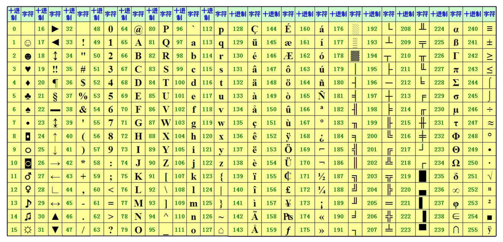

# REFS

- [Official document](https://docs.python.org/3/)

# Basic

## 变量

- id(var)
- define and use
- 定义规则
  - 由字母、数字、下划线组合
  - 首字符不能是数字
  - 变量名不能是关键字
- 驼峰命名
- 蛇形命名
- var = another_val
- del var

## 数据类型

type(var)

- 整数, int
- 浮点数, float
- 字符串, str
  - ', ", """
  - help(str)
  - str + str, str * num
  - str[a, b]
- 布尔, bool
  - True
  - False
- 列表, list
  - list()
  - insert(ind, obj)
  - append(obj)
  - remove(obj)
  - del li[ind]
  - obj in li
- 元组, tuple
- 字典, dict
- 集合, set

## 常用内置函数

- input()
- print()
- sort()

### 字符串常用方法

- upper(), lower(), capitalize()
- center(width, fillchar)
- count(sub, start, end)
- encode(encoding, errors)
  - bytes.decode(encoding, errors)
- endswith(suffix, start, end), startswith(suffix, start, end)
- find(sub, start, end)
- isxxx
  - isalnum()
  - isalpha()
  - isascii()
  - isdecimal()
  - isdigit()
  - isidentifier()
  - islower(), isupper()
- join(iterable)
- replace(old, new, count)
- strip(chars), rstrp, lstrp
- split(sep, maxsplit), splitlines

### 列表常用方法

- append()
- insert(ind, obj)
- extend(iterable)
- pop(ind)
- remove(obj)
- clear()
- index(obj)
- count(obj)
- li[a : b : step]
- sort()
- reverse()

### 字典常用方法

- keys()
- values()
- items()
- dic[key]
- dic.get(key, default)
- key in dic
- len(dic)

## 运算符

- 算术
  - +, -, *, /, %, **, //
- 比较
  - ==, !=, >, <, >=, <=
- 逻辑
  - and, or, not
- 赋值
  - =, +=, -=, *=, /=, %=, **=, //=
- 成员
  - in, not in
- 身份
- 位

## 流程控制

- if (elif) esle
- for range
  - enumerate(iterable)
  - dict.keys()
  - dict.values()
  - dict.items()
- while
- break & continue

# Advanced

## 字符编码

- ASCII



- Unicode

- UTF-n (Unicode Transformation Format)
  - UTF-8: 使用1 2 3 4字节表示所有字符，优先使用1字节（英文1字节，欧洲语系2字节，东亚3字节，其他4字节）
  - UTF-16: 2 4
  - UTF-32: 4

Python文件开头申明编码
```python
#encoding:utf-8
#!/usr/bin/env python

# -*- coding: utf-8 -*-
#!/usr/bin/env python
```

## 文件操作

文件操作流程：
1. 打开
2. 操作(增删改查)
   - open(file, mode, buffering, encoding, ...)
   - write(text)
   - read(size)
   - seek(offset, whence), whence:
     - 0 -- start of stream (the default); offset should be zero or positive
     - 1 -- current stream position; offset may be negative
     - 2 -- end of stream; offset is usually negative
   - close()
3. 关闭

### 打开模式

- r 只读
- w 创建
- a 追加