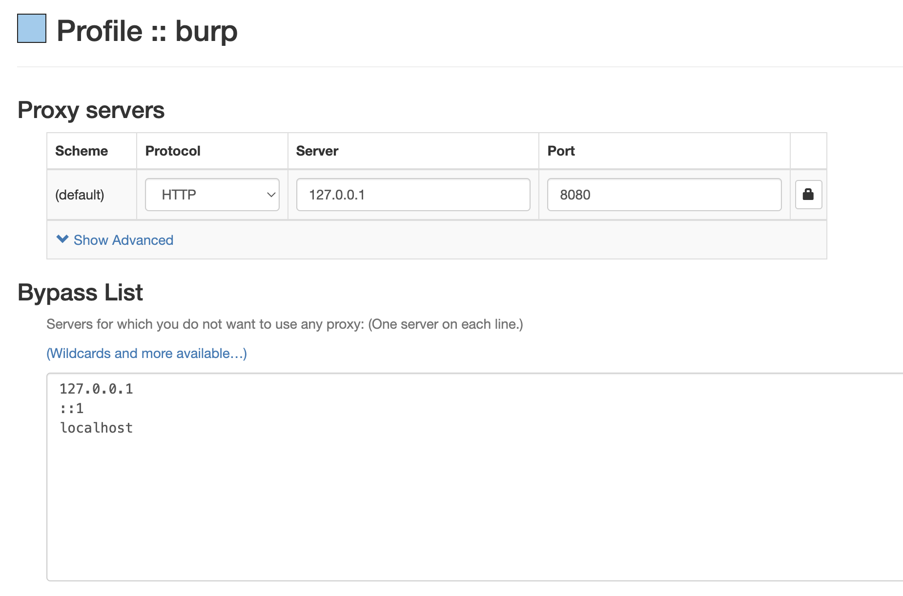
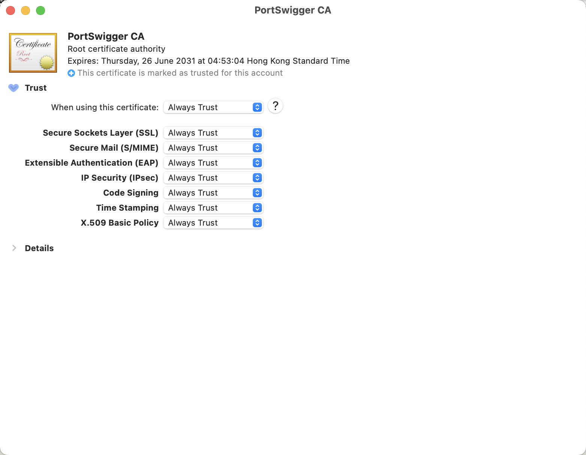
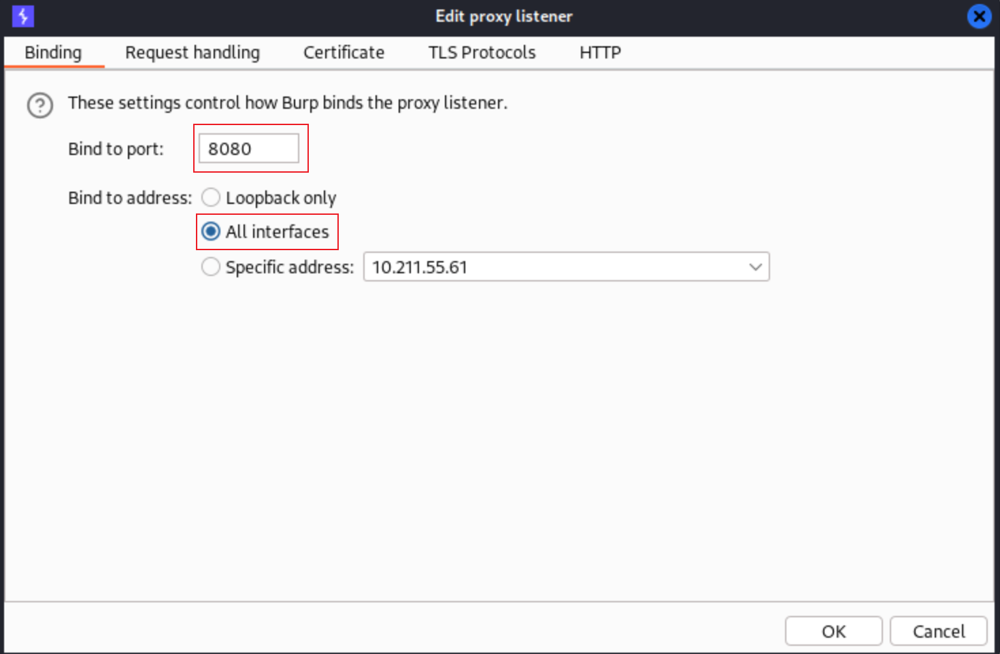

# Installation

Refs:
- [Official Document](https://exegol.readthedocs.io/)

```bash
# 1. install pre-requisites.
/bin/bash -c "$(curl -fsSL https://raw.githubusercontent.com/Homebrew/install/HEAD/install.sh)"
brew install git
brew install --cask docker
brew install --cask miniconda # brew install --cask anaconda
brew install --cask xquartz

# 2. config xquatz and docker.
# The XQuartz config Allow connections from network clients must be set to true
# Docker Desktop must be configured with default File Sharing (see screenshot below)
#   /tmp, /Users, /Volumes, /private, /var/folders

# 3. install exegol and add it into PATH.
python3 -m pip install exegol
## Using Exegol auto-completion.
## fish
register-python-argcomplete --no-defaults --shell fish exegol | source
register-python-argcomplete --no-defaults --shell fish exegol > ~/.config/fish/completions/exegol.fish
## zsh
##   activate:
autoload -U bashcompinit
bashcompinit
##   enable completion by adding the following command in ~/.zshrc config:
eval "$(register-python-argcomplete --no-defaults exegol)" >> ~/.zshrc
## bash
##   add the following command in ~/.bashrc config:
eval "$(register-python-argcomplete --no-defaults exegol)" >> ~/.bashrc
```

# Usage

Common usage:

```bash
exegol install full
exegol start
exegol stop
```

Wrapper actions:
- install
    ```bash
    exegol install
    exegol install full
    exegol install myimage
    #Build the myimage image based on the full profile and log the operation
    exegol install myimage full --build-log "/tmp/build.log"
    ```
- start
    ```bash
    # Start interactively a container
    exegol start
    # Create a demo container using full image
    exegol start demo full
    # Spawn a shell from demo container
    exegol start demo
    # Create a container test with a custom shared workspace
    exegol start test full -w "./project/pentest/"
    # Create a container test sharing the current working directory
    exegol start test full -cwd
    # Create a container htb with a VPN
    exegol start htb full --vpn "~/vpn/lab_Dramelac.ovpn"
    # Create a container app with custom volume
    exegol start app full -V "/var/app/:/app/"
    # Get a shell based on tmux
    exegol start --shell tmux
    ```
- info
- exec
- update
- stop
- restart
- remove
- uninstall
- version
    ```bash
    exegol version -vvv
    ```

# GUI

AUTOMATION script:

- [auto-exegol](https://github.com/zhsh9/auto-exegol)

Requirements:

- on macOS
  - socat
  - xquartz
- on docker container
  - libxkbcommon-x11-0
  - locales, ttf-xx-fonts

locales, locale-gen, zh_CN, zh_CN.utf8, ttf-wqy-microhei ttf-wqy-zenhei xfonts-wqy

Installation guide:

```bash
# on macOS
brew install socat
brew install xquartz --cask

# on container
##for QT:
sudo apt install -y libxkbcommon-x11-0
##for solving messy code:
## apt install -y locales, locale-gen
## solution: let linux to be capable with zh_CN.
```

Initiate services on macOS:

```bash
socat TCP-LISTEN:6000,reuseaddr,fork UNIX-CLIENT:"$DISPLAY"
open -a xquartz
```

another tiny point: when using socat, the difference between `$DISPLAY` and `"$DISPLAY"`. There are three ways to write the upward command:

```bash
socat TCP-LISTEN:6000,reuseaddr,fork UNIX-CLIENT:$DISPLAY
socat TCP-LISTEN:6000,reuseaddr,fork UNIX-CLIENT:"$DISPLAY"
socat TCP-LISTEN:6000,reuseaddr,fork UNIX-CLIENT:\"$DISPLAY\"
```

The difference between these three commands lies in how they handle the `$DISPLAY` variable.

- In the first command, the `$DISPLAY` variable is expanded outside of the double quotes. This means that if the `$DISPLAY` variable contains spaces or other special characters, these characters will be interpreted as shell syntax and may cause syntax errors.
- In the second command, the `$DISPLAY` variable is expanded inside the double quotes. This means that if the `$DISPLAY` variable contains spaces or other special characters, these characters will be treated as regular characters and the entire variable will be passed as one argument to the `UNIX-CLIENT` command.
- The third command is exactly the same to the second command, but uses backslashes to escape the double quotes so that the shell can correctly interpret them.

# BurpSuitePro and Host browser

1. Host
   1. docker run with port sharing.
      - exegol start $CONTAINER_NAME full -p 127.0.0.1:8080:8080
   2. broser proxy config (SwitchyOmega)
   
   3. install burp cacert.der
   
2. Container
   1. download burp cacert.der (url: burp/)
   2. change proxy setting
   