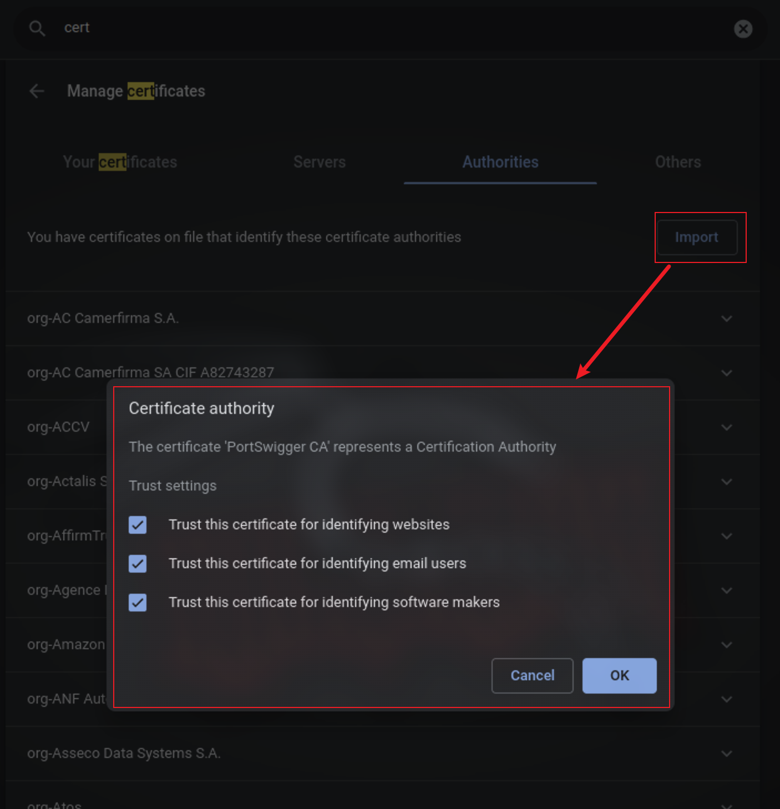
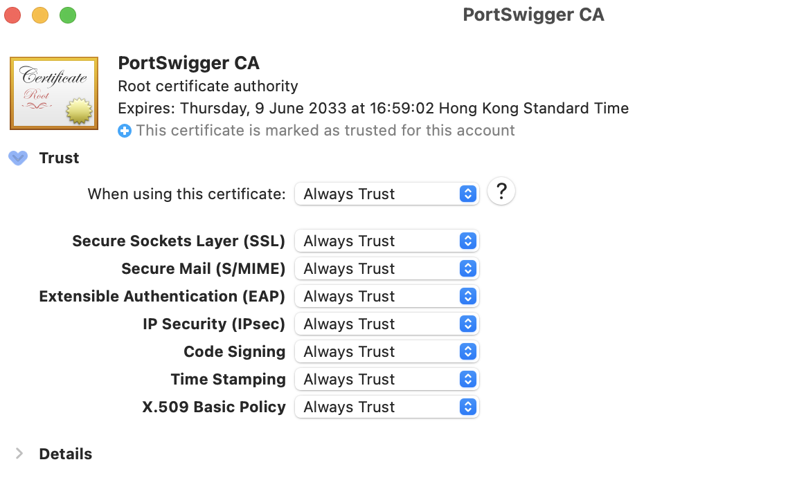

# REFs

- [BurpSuite Pro Download](https://portswigger.net/burp/releases)
- [Burp Loader Keygen](https://github.com/h3110w0r1d-y/BurpLoaderKeygen)
- [MacOS安装破解 BurpSuite 2023.4.2【持续更新】](https://www.lzskyline.com/index.php/archives/121/)

# Linux

Config BurpSuite Pro 2023.5.3 on Kali Linux 2023.2

```bash
curl -O https://github.com/h3110w0r1d-y/BurpLoaderKeygen/releases/download/1.14/BurpLoaderKeygen.jar
java -jar ./BurpLoaderKeygen.jar
```

Create and change `~/BurpSuitePro/user.vmoptions`
```
-Xmx1024m
--add-opens=java.base/java.lang=ALL-UNNAMED
--add-opens=java.base/jdk.internal.org.objectweb.asm=ALL-UNNAMED
--add-opens=java.base/jdk.internal.org.objectweb.asm.tree=ALL-UNNAMED
--add-opens=java.base/jdk.internal.org.objectweb.asm.Opcodes=ALL-UNNAMED
-javaagent:BurpLoaderKeygen.jar
-noverify
```

Config HTTPS (import cert, which downloaded from `burp/`, on Chrome)



# macOS

- Download `burpsuite_pro_macos_x64_v202x_x_x.dmg` and `BurpLoaderKeygen.jar`
- Move loader&keygen jar file to `/Applications/Burp Suite Professional.app/Contents/Resources/app`
- Create file `/Applications/Burp Suite Professional.app/Contents/user.vmoptions`
```bash
-Xmx1024m
--add-opens=java.base/java.lang=ALL-UNNAMED
--add-opens=java.base/jdk.internal.org.objectweb.asm=ALL-UNNAMED
--add-opens=java.base/jdk.internal.org.objectweb.asm.tree=ALL-UNNAMED
--add-opens=java.base/jdk.internal.org.objectweb.asm.Opcodes=ALL-UNNAMED
-javaagent:/path/to/BurpLoaderKeygen.jar
-noverify
```
- Lauch app, java run BurpLoaderKeygen.jar and register app
- Download cert from `burp/` and install it into macOS

